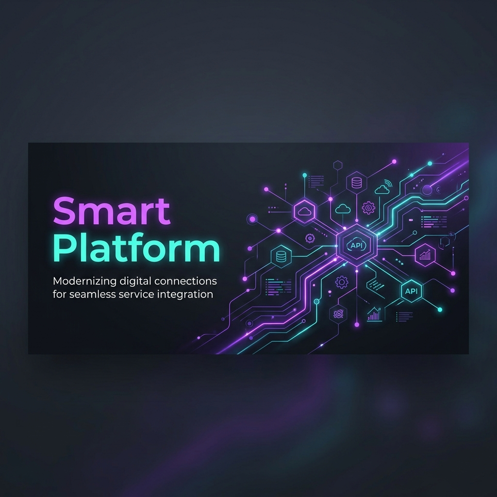
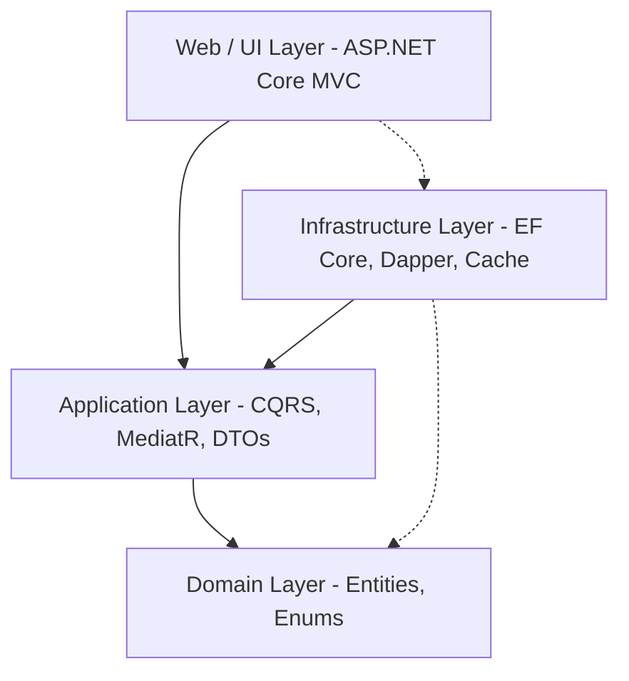

# <p align="center"></p>

<p align="center">
  
  
  
  
  
</p>

---

## 🚀 Overview

**Smart Platform** is a enterprise-grade, high-performance service provider booking platform built using **ASP.NET Core 8 MVC**. It establishes a reliable marketplace connecting service providers with clients.

The platform is designed following **Clean Architecture** principles and optimized for performance using **CQRS (Command Query Responsibility Segregation)**. It implements a unique dual-access database strategy: utilizing **Dapper** for lightning-fast reads and **Entity Framework Core** for write operations, all secured with advanced **Cache Stampede Protection** and **Cache Group Invalidation**.

---

## 🏗️ Architecture Design

The solution is divided into four distinct layers following **Clean Architecture** boundaries, ensuring the core business domain remains isolated, testable, and independent of external infrastructure or framework concerns.



### Layer Breakdown

1. **`SmartPlatform.Domain` (Core Domain)**
   - Contains enterprise-wide business models, core entities (`Service`, `ServiceRequest`, `Review`, `Category`), enums (`RequestStatus`), and custom identity models (`ApplicationUser`).
   - Zero external dependencies.

2. **`SmartPlatform.Application` (Use Cases)**
   - Implements CQRS (Command Query Responsibility Segregation) commands and queries using **MediatR**.
   - Contains DTOs, AutoMapper mapping profiles, FluentValidation rules, and service interfaces (e.g. `ICacheService`, `IReadDbConnection`).

3. **`SmartPlatform.Infrastructure` (External Concerns)**
   - Houses persistence details, including EF Core `ApplicationDbContext` (for commands/writes), Dapper `ReadDbConnection` (for queries/reads), generic repository implementations, and the Unit of Work (`UnitOfWork`).
   - Implements `MemoryCacheService` with thread-safe stampede protection and cache group invalidation logic.
   - Includes automatic database migration and seeding scripts.

4. **`Smart Platform` (Presentation / Web UI)**
   - An ASP.NET Core MVC application containing controllers, Razor views, custom middlewars (Global Exception Handler), and identity layout/pages.
   - Configures authentication, authorization, dependency injection, and cookies.

---

## ⚡ Performance Optimization: CQRS & Smart Caching

To ensure sub-millisecond response times under high concurrency, the application separates read and write flows:

### 1. The Dual-ORM Approach
- **Command (Write) Side**: Relies on EF Core combined with Repository and Unit of Work patterns. This guarantees transactional integrity, validation rules, change tracking, and consistent updates.
- **Query (Read) Side**: Bypasses EF Core tracking overhead entirely by using **Dapper** via `IReadDbConnection`. Queries retrieve flattened DTOs through optimized SQL queries directly.

### 2. Cache Stampede Protection
Under heavy traffic, multiple threads querying a missing cache key simultaneously can trigger a "stampede" on the database. Smart Platform's `ICacheService` prevents this by utilizing a thread-safe `GetOrCreateAsync` locking pattern.

```csharp
public async Task<T> GetOrCreateAsync<T>(
    string key, 
    Func<CancellationToken, Task<T>> factory, 
    TimeSpan? absoluteExpiration = null, 
    string? group = null, 
    TimeSpan? slidingExpiration = null, 
    CancellationToken cancellationToken = default)
```

### 3. Cache Group Invalidation
To keep the UI in sync without serving stale data, cache keys are organized into **Cache Groups** (e.g., `Services`, `Categories`). When a command modifies a database entity (e.g., updating a service), the application invalidates the entire group instantly:
- Creating/Updating a Service ➔ Evicts the `Services` group.
- Adding a Review ➔ Evicts the `Reviews_Service_X` group.

---

## 🌟 Key Features

- **Role-Based Authentication**: Secure customer, service provider, and administrator portals.
- **Dynamic Profiles**: Customized dashboards and profiles for customers and providers.
- **Service Discovery**: Advanced filtering, search, and category listing.
- **Booking Flow**: Step-by-step request tracking:
  `Pending` ➔ `Approved` / `Rejected` ➔ `Completed` / `Cancelled`.
- **Review System**: Trustworthy rating & comment submissions after job completion.
- **Real-time Dashboards**:
  - *Provider Dashboard*: Total Revenue, Pending Requests, Completed Jobs, Monthly Revenue chart, and Top Services.
  - *Admin Dashboard*: Global system performance, user activity, and category management.
- **Global Error Handling**: Custom exception middleware that formats runtime errors into user-friendly responses.

---

## 🛠️ Technology Stack

- **Framework**: .NET 8.0 (C#)
- **Web App**: ASP.NET Core MVC & Razor Pages
- **ORM / Persistence**: Entity Framework Core 8, Dapper (Micro-ORM)
- **Database**: Microsoft SQL Server
- **Caching**: ASP.NET Core Memory Cache (Wrapper)
- **Validation**: FluentValidation
- **Mapping**: AutoMapper
- **Authentication**: ASP.NET Core Identity
- **UI & Frontend**: Bootstrap 5, Vanilla CSS, FontAwesome

---

## 🚀 Getting Started

### Prerequisites
- **.NET 8.0 SDK** or higher.
- **Microsoft SQL Server** (LocalDB or Express).

### Installation & Run

1. **Clone the Repository**
   ```bash
   git clone https://github.com/Mw8969040/Services_Providers.git
   cd "Services_Providers"
   ```

2. **Configure Connection String**
   Open `appsettings.json` in the web project (`Smart Platform`) and update the connection string to point to your local SQL Server instance:
   ```json
   "ConnectionStrings": {
     "DefaultConnection": "Server=(localdb)\\mssqllocaldb;Database=SmartPlatformDb;Trusted_Connection=True;MultipleActiveResultSets=true"
   }
   ```

3. **Restore Packages & Build**
   ```bash
   dotnet restore
   dotnet build
   ```

4. **Run the Application**
   The application is configured to run database migrations and seed default values automatically on startup.
   ```bash
   dotnet run --project "Smart Platform/Smart Platform.csproj"
   ```
   Open your browser and navigate to `https://localhost:7214` (or the HTTP/HTTPS port displayed in your terminal).

---

## 🔑 Demo Credentials

On startup, the system automatically seeds the database with the following demo accounts:

| Role | Email | Password | Description |
| :--- | :--- | :--- | :--- |
| **Admin** | `admin@smartplatform.com` | `Admin@123` | Global platform administration |
| **Provider** | `provider@smartplatform.com` | `Provider@123` | Test Service Provider with active services |
| **Customer** | `customer@smartplatform.com` | `Customer@123` | Test Customer to book services & write reviews |

---

## 📜 License

This project is licensed under the MIT License - see the [LICENSE](LICENSE) file for details.
